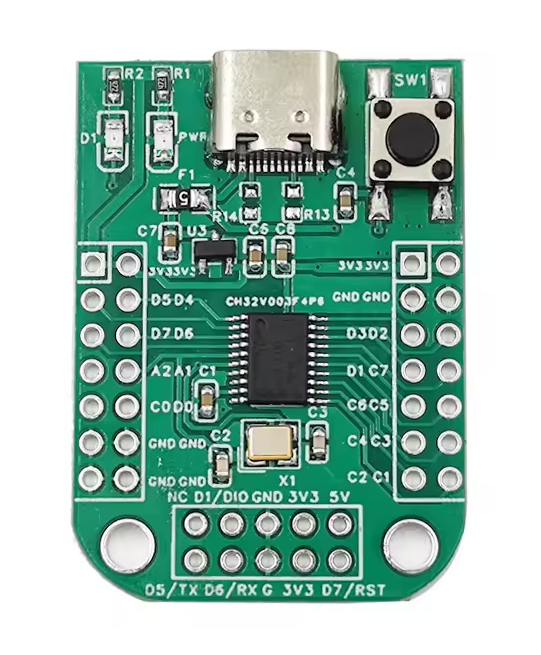
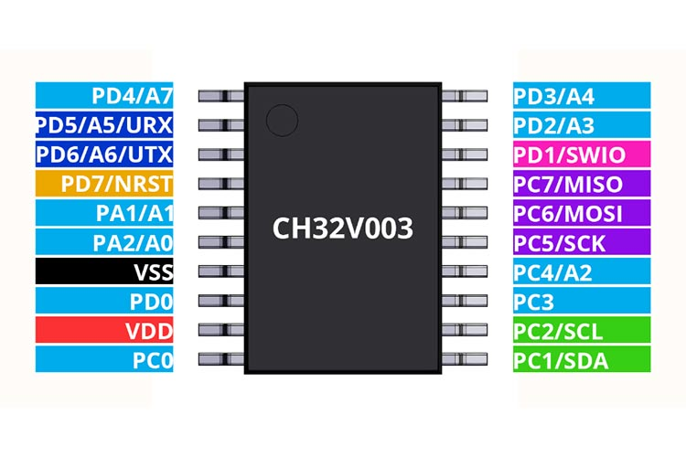

# README
A basic template for Rust projects based on the CH32v003

**MAKE SURE TO UPDATE**

Make sure to update `.cargo/config.toml` to match how you are connecting to the CH32v003 (probe or other methods)

## Getting started

Follow guide here: https://embassy.dev/book/dev/getting_started.html

## Running 

plug in the dev board and just run:
```bash
cargo run --release
```

by default the repo uses wlink for programming. It should be installed first from: https://github.com/ch32-rs/wlink

## Devboard Example
(must have an external wlink programer)

